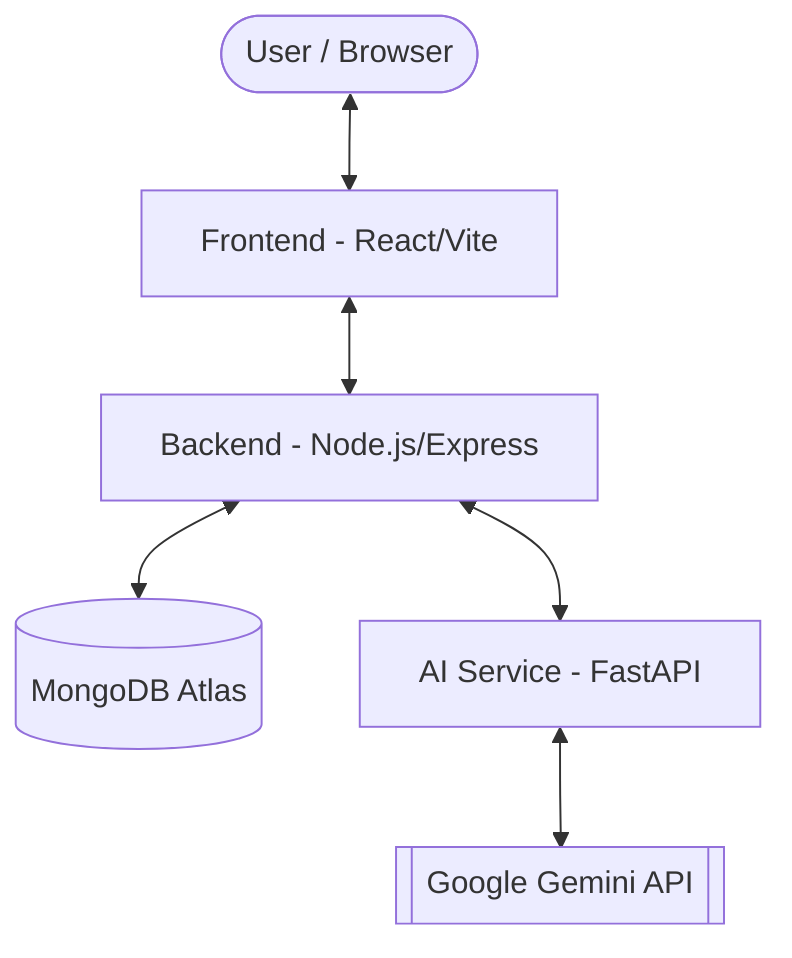

# Prepify - AI-Powered Interviewer 🚀

Prepify is a state-of-the-art AI Interview platform designed to help candidates prepare for their dream roles. By leveraging advanced generative AI and real-time audio processing, Prepify simulates realistic interview scenarios, providing instant feedback and personalized coaching.

---

## 🏗️ Architecture Overview

Prepify follows a modern, distributed 3-tier architecture designed for scalability and performance:



- **Frontend**: A responsive and interactive React application built with Vite and TypeScript.
- **Backend**: An Express.js server managing authentication, session state, and real-time communication via Socket.io.
- **AI Service**: A high-performance Python microservice powered by FastAPI, specializing in audio transcription and AI-driven interview evaluation using Google Gemini.

---

## ✨ Key Features

- **🎯 Role-Specific Interviews**: Tailored questions based on specific job roles and seniority levels.
- **🎙️ Real-time Audio Transcription**: Efficient processing of verbal answers using Gemini's native audio support.
- **🧠 Intelligent Evaluation**: Comprehensive feedback on answer quality, communication skills, and technical accuracy.
- **🔒 Secure Authentication**: Robust user management with Google OAuth and JWT.
- **⚡ Live Progress Tracking**: Real-time updates during interview processing via WebSockets.

---

## 🛠️ Tech Stack

| Component | Technologies |
| :--- | :--- |
| **Frontend** | React, Vite, TypeScript, Lucide Icons, Socket.io-client |
| **Backend** | Node.js, Express, MongoDB (Mongoose), Socket.io, JWT |
| **AI Service** | Python, FastAPI, Google Gemini API, Uvicorn |
| **Deployment** | Render (Services), Vercel (Frontend), MongoDB Atlas |

---

## 🚀 Quick Start

### 1. Prerequisites
- **Node.js 18+**
- **Python 3.10+**
- **MongoDB** (Local or Atlas)
- **Google Gemini API Key**

### 2. Setup All Components
For detailed setup instructions for each service, please refer to their respective READMEs:
- [/backend](./backend/README.md)
- [/ai-service](./ai-service/README.md)
- [/frontend](./frontend/README.md)

### 3. Running Locally
We've provided a helper script for Windows users:
```bash
./start-all.bat
```
Alternatively, start each service manually as described in the [Deployment Guide](./DEPLOYMENT_GUIDE.md).

---

## 📂 Project Structure

```text
AI-Interviewer/
├── ai-service/     # Python microservice for AI & Audio processing
├── backend/        # Node.js Express server & API
├── frontend/       # React application (Vite/TS)
├── start-all.bat   # Windows start script
└── DEPLOYMENT_GUIDE.md # Detailed deployment instructions
```

---

## 📜 License

This project is licensed under the MIT License - see the [LICENSE](./LICENSE) file for details.


