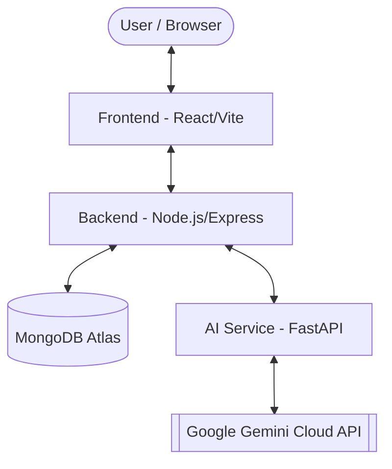

# Prepify - AI-Powered Interviewer 🚀

Prepify is a state-of-the-art AI Interview platform designed to help candidates prepare for their dream roles. By leveraging advanced generative AI and real-time audio processing, Prepify simulates realistic interview scenarios, providing instant feedback and personalized coaching.

---

## 🏗️ Architecture Overview

Prepify follows a modern, distributed 3-tier architecture designed for scalability and performance within cloud resource constraints (e.g., 512MB RAM limits):



- **Frontend**: A "Neo-Dark" React/Vite application utilizing **IndexedDB** for recording persistence and **Skeleton Screens** for professional loading states.
- **Backend**: A hardened Express.js server managing authentication (HttpOnly JWT), session orchestration, and **real-time WebSocket synchronization** via Socket.io.
- **AI Service**: A high-efficiency Python microservice that offloads heavy transcription and evaluation tasks to the Google Gemini Cloud API to minimize local resource footprint.

---

## ✨ Key Features

- **🎯 Role-Specific Interviews**: Tailored questions based on job roles, seniority levels, and specific tech stacks.
- **🎙️ Persistent Recording**: Never lose a draft. Audio recordings are persisted in **IndexedDB**, allowing users to resume interviews after browser restarts.
- **⏱️ Live Interview Terminal**: Interactive coder interface with real-time **Interview Timers** and code draft persistence.
- **👁️ Skeleton Loading**: Professional shimmer-based placeholders for a seamless, low-latency UI feel.
- **🧠 Intelligent Evaluation**: Comprehensive feedback on answer quality, communication skills, and technical proficiency.
- **📁 Result Exporting**: One-click **PDF Export** for interview performance reports.
- **🔒 Production Hardened**: Includes **Rate Limiting**, Prompt Injection guardrails, and secure HttpOnly cookie authentication.

---

## 🛠️ Tech Stack

| Component | Technologies |
| :--- | :--- |
| **Frontend** | React, Vite, TypeScript, Framer Motion, IndexedDB, Socket.io-client |
| **Backend** | Node.js, Express, MongoDB, Socket.io, JWT, Express Rate Limit |
| **AI Service** | Python, FastAPI, Google Gemini API, Pydantic |
| **Deployment** | Render (Services), Vercel (Frontend), MongoDB Atlas |

---

## 🚀 Quick Start

### 1. Prerequisites
- **Node.js 18+**
- **Python 3.10+**
- **MongoDB** (Local or Atlas)
- **Google Gemini API Key**

### 2. Setup All Components
For detailed setup instructions for each service, please refer to their respective READMEs:
- [/backend](./backend/README.md)
- [/ai-service](./ai-service/README.md)
- [/frontend](./frontend/README.md)

### 3. Running Locally
We've provided a helper script for Windows users:
```bash
./start-all.bat
```
Alternatively, start each service manually as described in the [Deployment Guide](./DEPLOYMENT_GUIDE.md).

---

## 📂 Project Structure

```text
AI-Interviewer/
├── ai-service/     # Python microservice for AI & Audio processing
├── backend/        # Node.js Express server & API
├── frontend/       # React application (Vite/TS)
├── start-all.bat   # Windows start script
└── DEPLOYMENT_GUIDE.md # Detailed deployment instructions
```

---

## 📜 License

This project is licensed under the MIT License - see the [LICENSE](./LICENSE) file for details.


